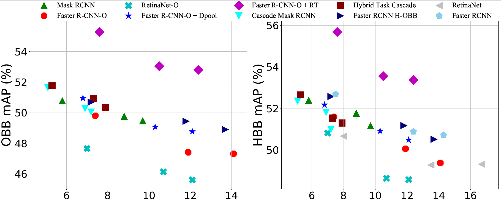
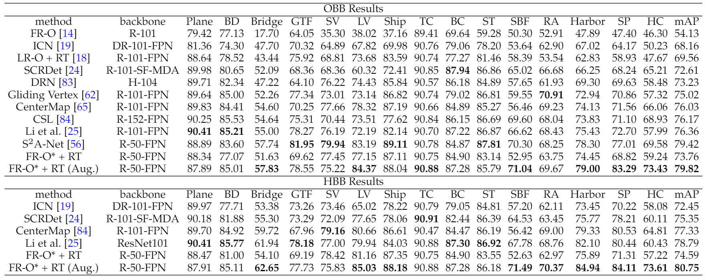
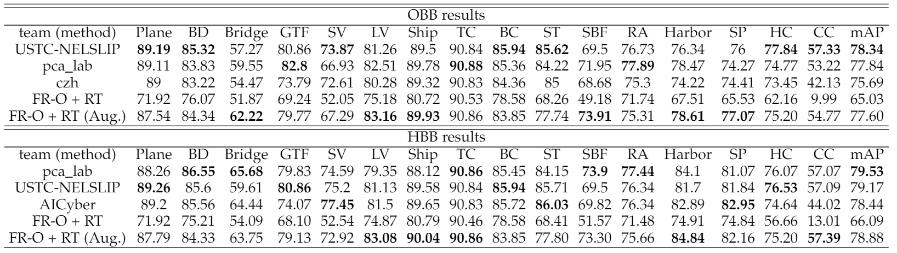
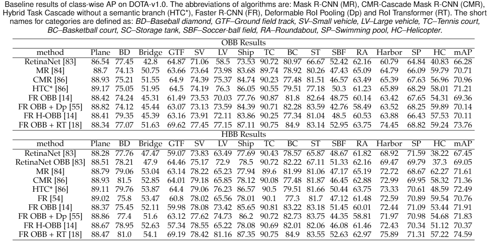
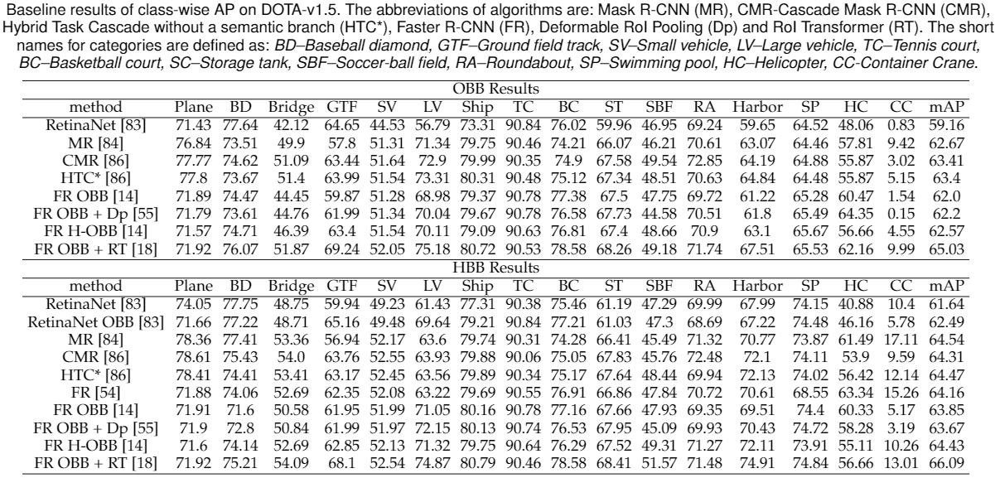
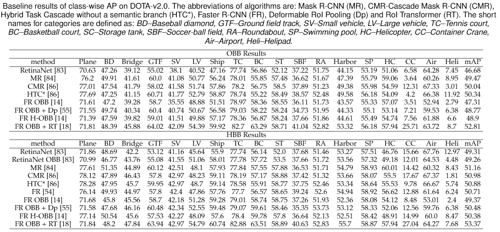

# Benchmark and Model Zoo

## Environment

### Hardware

- 4 NVIDIA Tesla V100 GPUs
- Intel(R) Xeon(R) CPU E5-2640 v4 @ 2.40GHz
### Software environment

- Python 3.6 / 3.7
- PyTorch 1.1.0
- CUDA 10.0.176
- CUDNN 7.4.1

## Common settings

- All baselines were trained using 4 GPU with a batch size of 8 (2 images per GPU). 
- We adopt the same training schedules as Detectron. 1x indicates 12 epochs and 2x indicates 24 epochs, which corresponds to slightly less iterations than Detectron and the difference can be ignored.
- We report the inference time as the overall time including data loading, network forwarding and post processing in chips with size of 1024.

## Baselines
The folowing shows the baseline results. For more results, see our [paper](https://arxiv.org/abs/2102.12219).
- Baseline results on DOTA (R-FPN-50, without data augmentations)

- Baseline results of different backbones on DOTA-v2.0 (without data augmentations). 

[comment]: <> (- Ablation study of data augmentation on DOTA-v1.5.)

[comment]: <> (![dataaug]&#40;data-aug.png&#41;)

- SOTA on DOTA-v1.0.

- SOTA on DOTA-v1.5.

  
- Class-wise AP on DOTA-v1.0.

- Class-wise AP on DOTA-v1.5.

- Class-wise AP on DOTA-v2.0.

