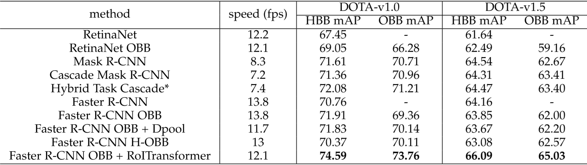

# Benchmark and Model Zoo

## Environment

### Hardware

- 4 NVIDIA Tesla V100 GPUs
- Intel(R) Xeon(R) CPU E5-2640 v4 @ 2.40GHz
### Software environment

- Python 3.6 / 3.7
- PyTorch 1.1.0
- CUDA 10.0.176
- CUDNN 7.4.1

## Common settings

- All baselines were trained using 4 GPU with a batch size of 8 (2 images per GPU). 
- We adopt the same training schedules as Detectron. 1x indicates 12 epochs and 2x indicates 24 epochs, which corresponds to slightly less iterations than Detectron and the difference can be ignored.
- We report the inference time as the overall time including data loading, network forwarding and post processing in chips with size of 1024.

## Baselines

More benchmark results based on the code are on the way.
- Baseline results on DOTA (R-FPN-50, without data augmentation)

