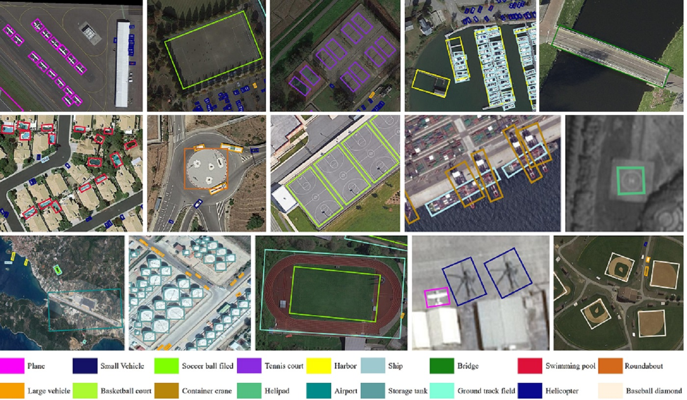

# Benchmarks for Object Detection in Aerial Images

## Introduction
This codebase is created to build benchmarks for object detection in aerial images.
It is modified from [mmdetection](https://github.com/open-mmlab/mmdetection).
The master branch works with **PyTorch 1.1** or higher. If you would like to use PyTorch 0.4.1,
please checkout to the [pytorch-0.4.1](https://github.com/open-mmlab/mmdetection/tree/pytorch-0.4.1) branch.


### Main Features
To adapt to object detection in aerial images, this repo has several unique and new features compared to the original [mmdetection](https://github.com/open-mmlab/mmdetection)
- **Support Oriented Object Detection**
    
    In aerial images, objects are usually annotated by oriented bounding box (OBB).
    To support oriented object detection, we implement OBB Head (OBBRoIHead and OBBDenseHead). 
    Also, we provide functions to transfer mask predictions to OBBs.

- **Cython Bbox Overlaps**
    
    Since one patch image with the size of 1024 &times; 1024 may contain over 1000 instances
     in [DOTA](https://captain-whu.github.io/DOTA/), which make the bbox overlaps memroy consuming.
     To avoid out of GPU memory, we calculate the bbox overlaps in cython. 
     The speed of cython version is close to the GPU version.

- **Rotation Augmentation**
    
    Since there are many orientation variations in aerial images, we implement the online rotation augmentation.
    
- **Rotated RoI Warping**

    Currently, we implement two types of rotated RoI Warping (Rotated RoI Align and Rotated Position Sensitive RoI Align).

   
## License

This project is released under the [Apache 2.0 license](LICENSE).

## Benchmark and model zoo

- Results are available in the [Model zoo](MODEL_ZOO.md).
- You can find the detailed configs in configs/DOTA.
- The trained models are available at [Google Drive](https://drive.google.com/drive/folders/1IsVLm7Yrwo18jcx0XjnCzFQQaf1WQEv8?usp=sharing) or [Baidu Drive](https://pan.baidu.com/s/1aPeoPaQ0BJTuCsGt_DrdmQ).
## Installation


  Please refer to [INSTALL.md](INSTALL.md) for installation.


    
## Get Started

Please see [GETTING_STARTED.md](GETTING_STARTED.md) for the basic usage of mmdetection.

## Contributing

We appreciate all contributions to improve benchmarks for object detection in aerial images. 


## Citing

If you use [DOTA](https://captain-whu.github.io/DOTA/) dataset, codebase or models in your research, please consider cite .

```
@misc{ding2021object,
      title={Object Detection in Aerial Images: A Large-Scale Benchmark and Challenges}, 
      author={Jian Ding and Nan Xue and Gui-Song Xia and Xiang Bai and Wen Yang and Micheal Ying Yang and Serge Belongie and Jiebo Luo and Mihai Datcu and Marcello Pelillo and Liangpei Zhang},
      year={2021},
      eprint={2102.12219},
      archivePrefix={arXiv},
      primaryClass={cs.CV}
}
@inproceedings{xia2018dota,
  title={DOTA: A large-scale dataset for object detection in aerial images},
  author={Xia, Gui-Song and Bai, Xiang and Ding, Jian and Zhu, Zhen and Belongie, Serge and Luo, Jiebo and Datcu, Mihai and Pelillo, Marcello and Zhang, Liangpei},
  booktitle={Proceedings of the IEEE Conference on Computer Vision and Pattern Recognition},
  pages={3974--3983},
  year={2018}
}

@article{chen2019mmdetection,
  title={MMDetection: Open mmlab detection toolbox and benchmark},
  author={Chen, Kai and Wang, Jiaqi and Pang, Jiangmiao and Cao, Yuhang and Xiong, Yu and Li, Xiaoxiao and Sun, Shuyang and Feng, Wansen and Liu, Ziwei and Xu, Jiarui and others},
  journal={arXiv preprint arXiv:1906.07155},
  year={2019}
}

@InProceedings{Ding_2019_CVPR,
author = {Ding, Jian and Xue, Nan and Long, Yang and Xia, Gui-Song and Lu, Qikai},
title = {Learning RoI Transformer for Oriented Object Detection in Aerial Images},
booktitle = {The IEEE Conference on Computer Vision and Pattern Recognition (CVPR)},
month = {June},
year = {2019}
}
```

## Thanks to the Third Party Libs

[Pytorch](https://pytorch.org/)

[mmdetection](https://github.com/open-mmlab/mmdetection)